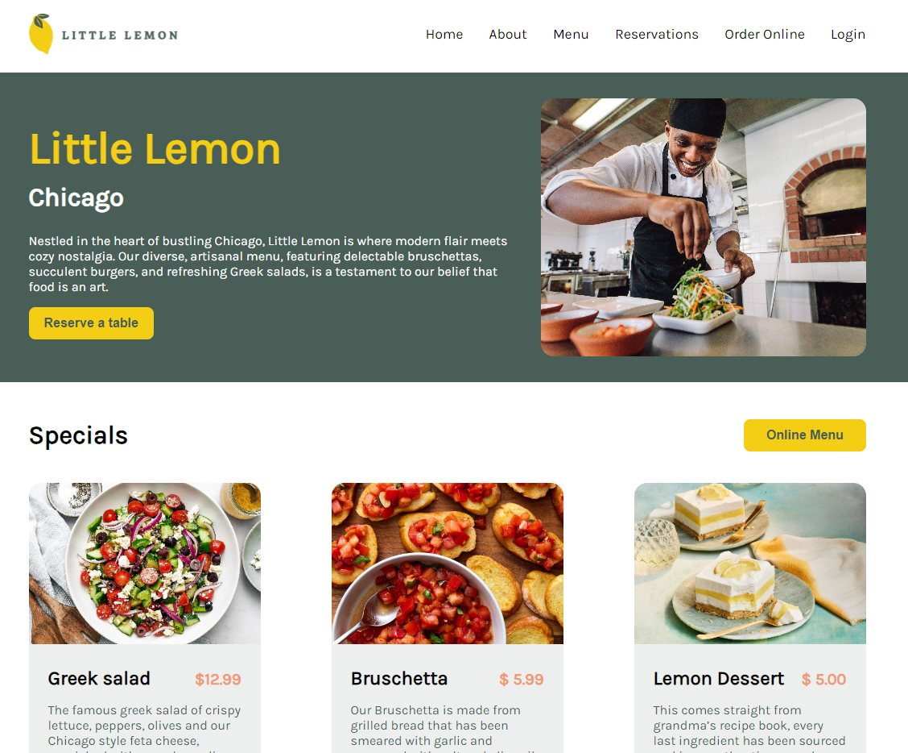

# Little Lemon :lemon:

Welcome to the Little Lemon Restaurant website repository. This project was created as a part of the Meta Frontend Developer course. It's built using React and offers a stylish interface for users who want to explore the restaurant's menu and make reservations.

## Live Preview

Check out the live version of the website! [View Live Demo](https://littlelemon.leanczo.vercel.app/)

## Features

- Smooth navigation through the pages.
- Explore the restaurant's menu in style.
- Make a reservation using an interactive form.
- Receive a reservation confirmation through a popup.
- Built with React for a modern and interactive user experience.

## Available Scripts

In the project directory, you can run:

### `npm install`
The npm install command is used to install all the dependencies defined in your project's package.json file. 

### `npm start`

Runs the app in development mode.\
Open [http://localhost:3000](http://localhost:3000) to view it in your browser.

### `npm test`
Launches the test runner in the interactive watch mode.
It runs all the tests for the application and provides feedback on their status.

The test files are typically located in a directory named __tests__ or have a .test.js or .spec.js extension.

Make sure to write comprehensive tests to ensure the stability and correctness of the application.
